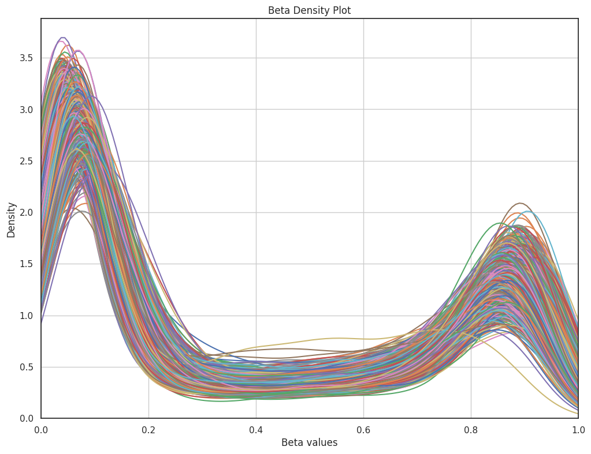
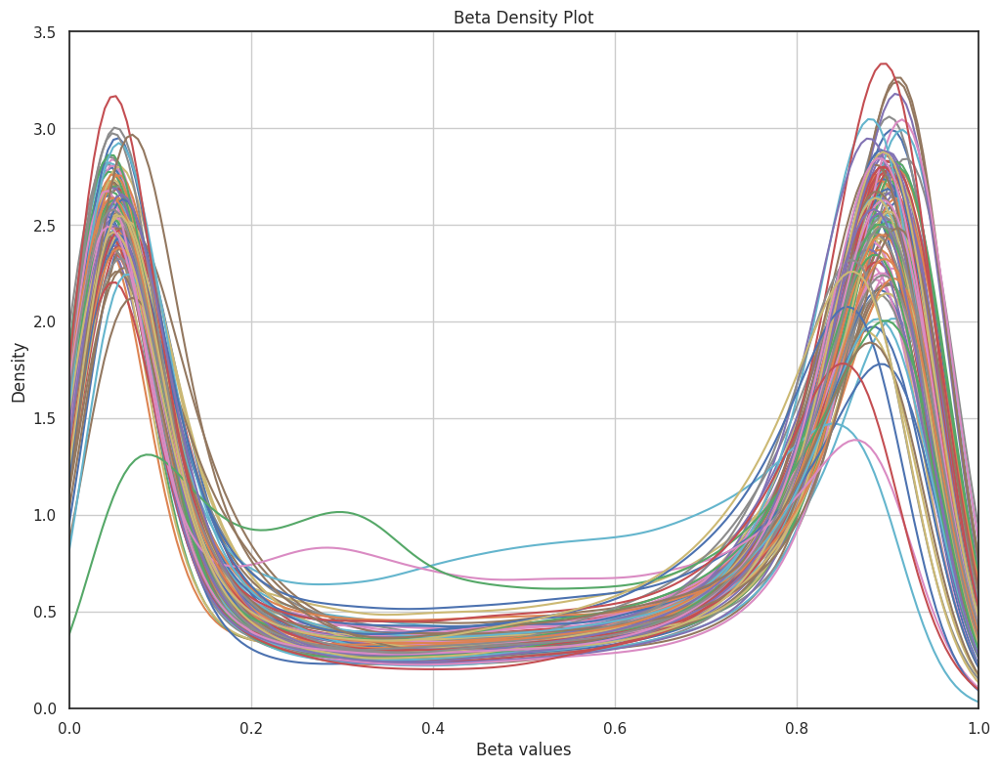
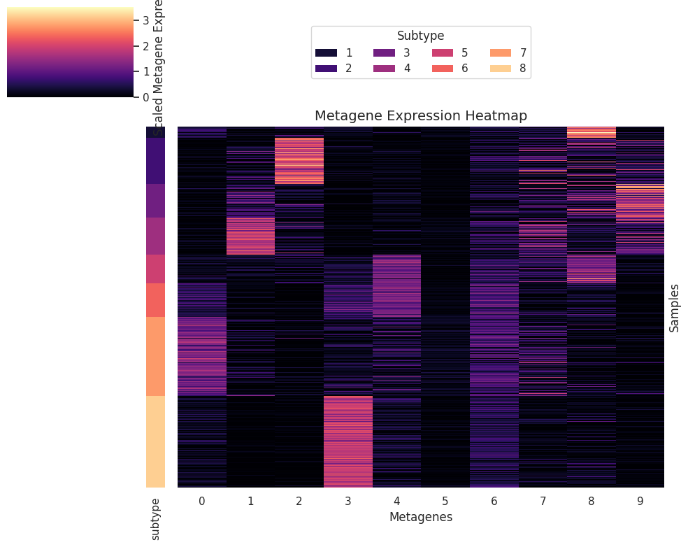
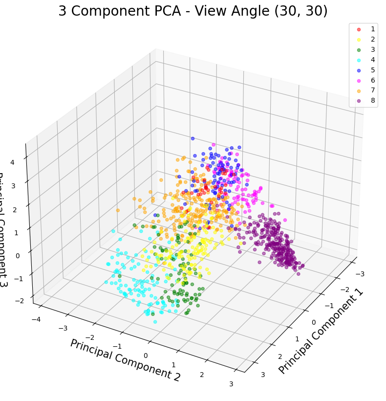
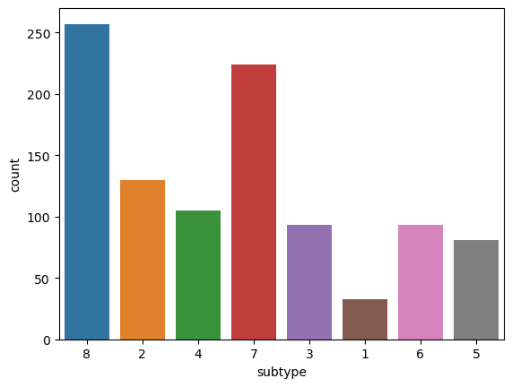
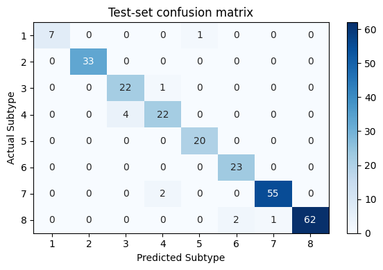
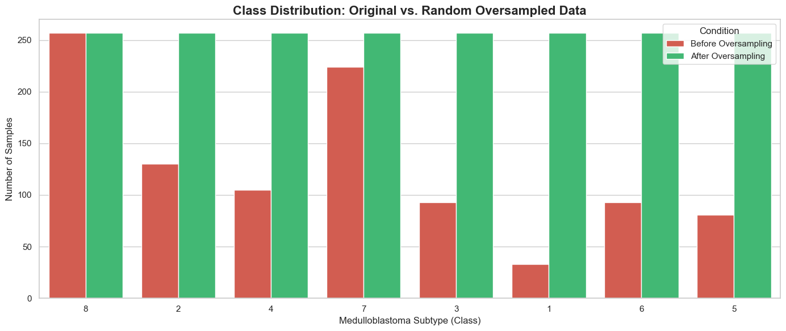
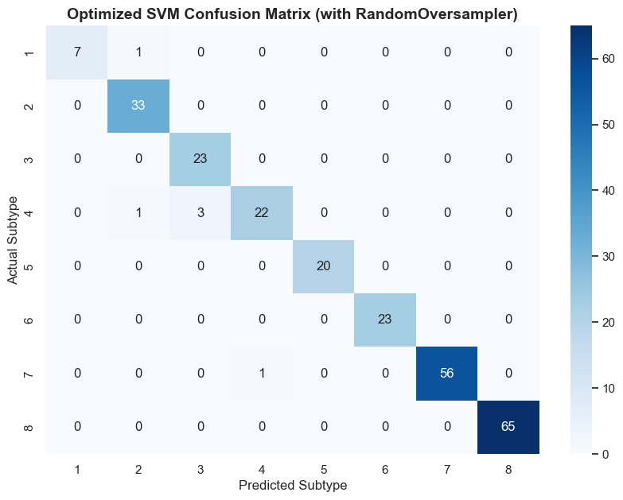
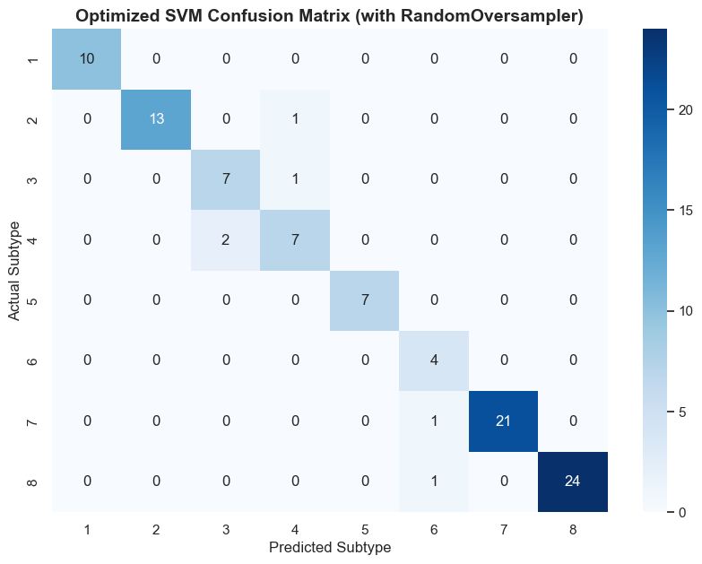

# Medulloblastoma methylation study

**Ibrahim Ineizeh · AI for Health · February–April 2026**

This project brings together my two assessments on DNA methylation data from Group 3 and Group 4 medulloblastoma. In the first part, I prepared the data, filtered probes, and explored the eight molecular subtypes using NMF and PCA. In the second part, I trained an SVM classifier, investigated its errors, and compared its performance on HM450-compatible and EPIC representations.

The [study notebook](notebooks/medulloblastoma_study.ipynb) contains my original code, explanations, and saved outputs from both assessments. This report follows the decisions I made and the results I obtained. The later reusable Python implementation is documented separately in [the methodology notes](docs/METHODOLOGY.md); its rerun results do not replace the assessment results below.

## 1. Preparing the methylation data

I read *Second-generation molecular subgrouping of medulloblastoma: an international meta-analysis of Group 3 and Group 4 subtypes*, and *Cross-Platform DNA Methylation Classifier for the Eight Molecular Subtypes of Group 3 & 4 Medulloblastoma*. I used GEO study GSE130051 and followed the broad preparation process in the second paper, with additional probe filtering.

The two platforms were the Illumina HumanMethylation450 BeadChip and Infinium MethylationEPIC. I worked with methylation beta values, which represent the relative methylation signal at each probe on a scale from 0 to 1. The HM450 beta values were supplied as a processed file. For EPIC, I used the raw IDAT files to extract beta values myself.

### Extracting EPIC beta values in R

The methods section in the cross-platform paper explained how to extract the dataset, but I made my own solution: a small R script that reads the IDAT pairs safely, identifies EPIC samples using their number of probes, and passes them to SeSAMe. I used `noob()` followed by `getBetas()`, combined the beta vectors using their common probes, and saved the resulting matrix as a CSV file.

The original script is included in the notebook. It uses `tryCatch()` so an unreadable IDAT pair does not stop the entire extraction. Probe count was a practical way to distinguish the arrays in this study. Quality masking was then handled separately in the Python preparation work. This records the procedure I used; it is not a claim that I reproduced every preprocessing step from the paper.

### Working with the large HM450 file

The HM450 beta-value file was around 13 GB, which made it difficult to load and process. I used Google Colab Pro with 51 GB of RAM. The EPIC file was smaller.

I also wrote a function to process the GEO series-matrix files. Sample identifiers, characteristics, and quoted values needed to be extracted and cleaned. I used this metadata to match beta values to sample IDs and remove samples without a subtype assignment (`MBNOS`). Keeping these identifiers aligned was important; even a correct feature matrix would give misleading results if its labels belonged to different samples.

### Probe filtering

I applied the following filters to each platform:

1. Keep probes whose identifiers start with `cg`.
2. Apply the `MASK_mapping`, `MASK_snp5_GMAF1p`, and `MASK_sub30_copy` annotations used in the preparation process.
3. Exclude sex-linked and control probes using `methylcheck`.
4. Remove additional probes listed as problematic by `methylcheck`.

I used the additional problematic-probe filter to make a more restricted panel for the subsequent analysis. The original preparation retained 1,370 labeled observations in the HM450-compatible matrix and 99 EPIC observations. After the complete platform-specific filtering, the matrices contained 129,152 HM450 probes and 461,845 EPIC probes. The saved missing-value check found no missing values in either filtered matrix.

I plotted the beta distributions to inspect the filtered data. Both figures show the methylation patterns across samples, and the EPIC distribution has substantial density near both ends of the beta scale. These plots helped me inspect the data; they do not by themselves establish that all technical effects have been removed.

*HM450 beta-density plot from the first assessment.*

*EPIC beta-density plot after the same preparation stage.*

## 2. Splitting the data and exploring the subtypes

Once I had the filtered data, I separated the HM450 observations into those used for training and testing and those associated with the EPIC validation samples. The 1,271 observations from the HM450-platform cohort were split 80:20 with subtype stratification and `random_state=42`, giving 1,016 training samples and 255 test samples. The other 99 observations in the HM450-compatible matrix were reserved as one validation view, while the EPIC measurements formed the second view.

At first, including two validation sets with the same sample identities can look redundant. I retained them because their methylation values came from different measurement or processing views, allowing me to examine whether the classifier behaved consistently across platforms. They are paired observations within the same study, so they should not be interpreted as two independent patient cohorts.

### The exploratory probe panel

For the first assessment, I selected the 25,000 probes with the highest standard deviation in the training set. I then calculated correlation with the numbered subtype labels and retained probes with an absolute correlation of at least 0.4. This left 11,601 probes. Intersecting their identifiers across all four matrices produced a common panel of 9,010 probes.

I performed the variability and correlation calculations on the training data to avoid using test labels for selection. Correlation treats the subtype numbers as ordered numerical values, although they represent categories. This makes the selection sensitive to the label encoding. The 9,010-probe panel is therefore an exploratory assessment result, rather than a generally validated feature-selection rule.

### NMF metagenes and PCA visualization

I used non-negative matrix factorization because the beta-value matrices contain non-negative values. In the first assessment, I fitted NMF to the transposed training matrix and used the sample coefficients as a reduced representation with 10 components. I compared these components, described as metagenes in the notebook, across subtypes.

*The first assessment's sample coefficients, arranged by subtype.*

The dominant-component table showed clear patterns for several subtypes. For example, all 33 subtype 1 training samples had the ninth component (column `8`) as their largest coefficient, and 256 of the 257 subtype 8 samples had the fourth component (column `3`) as their largest coefficient. Other subtypes were distributed across several components. These are patterns in the fitted representation; the largest coefficient should not be read as a percentage biological contribution or proof of a causal relationship.

After NMF, I standardized the coefficients and used three PCA components. I chose three components because I aimed to visualize the clusters in 3D, rather than because three captured a particular target percentage of variance.

*One of the eight viewing angles saved in the original notebook.*

From these plots, subtype 8 looked comparatively compact and separated, while subtype 7 was separated but more spread out. Some other subtypes overlapped in the projection. I used this as an initial view of the data, while keeping in mind that a three-dimensional projection can hide distinctions present in the full representation.

## 3. Developing the classifier

The second assessment used a supplied common-probe training file containing 13,916 probes. Intersecting this with the available filtered matrices left 11,234 probes. This was the actual input panel for the classifier experiments below, and differs from the first assessment's 9,010-probe exploratory panel.

The second assessment contained 1,016 training samples, 255 test samples, 99 HM450 validation samples, and 97 EPIC validation samples. The earlier preparation had 99 EPIC observations; the later EPIC file contained 97. The saved work does not establish why those two observations were absent, so the reported EPIC evaluation uses its actual denominator of 97. [The data notes](docs/DATA.md) describe the files and the relationship between these stages.

### Baseline SVM with 10 NMF components

I chose support vector classification because the methylation data were high dimensional and the boundaries between subtypes could be complex. For the baseline, I fitted NMF on the sample-by-probe training matrix, then transformed the test data using the same fitted NMF model. This gave 10 features per sample.

The initial SVC used an RBF kernel, `C=1.0`, `gamma='scale'`, and `class_weight='balanced'`. I used balanced weights because the training distribution was uneven: subtype 1 had only 33 samples, whereas subtype 8 had 257.

The baseline misclassified 11 of the 255 test samples. Its accuracy was 0.9569 and its macro F1 score was 0.9472. Subtype 4 had the lowest F1 score, at 0.86, and four of its samples were assigned to subtype 3. Subtype 1 had a recall of 0.88, corresponding to one error among its eight test samples.

*Confusion matrix for the 255-sample test set. The title and axis labels have been corrected to show subtypes 1–8; all original confusion counts are preserved.*

I also examined prediction probabilities, learning curves, and validation curves. The curves showed that the classifier was sensitive to `C` and `gamma`, giving me a reason to tune them systematically. The probability analysis helped identify uncertain predictions, but the gap between the two highest probabilities is not the SVM's decision-function margin or a clinically validated confidence threshold.

### Oversampling and tuning

To address the uneven subtype distribution, I used random oversampling. The demonstration increased the training representation from 1,016 to 2,056 rows, giving each subtype the same count. These were duplicated observations from the minority classes, rather than newly collected biological samples.

For tuning, I used an imbalanced-learn pipeline with oversampling, standardization, and SVC. The grid search compared linear and RBF kernels, several values of `C` and `gamma`, and both balanced and unweighted classes. I used five-fold cross-validation and selected the best configuration using macro F1, so minority-subtype performance contributed equally to the selection metric.

For 10 components, the selected classifier used an RBF kernel, `C=1`, `gamma='scale'`, and no additional class weights. Its recorded CV macro F1 was 0.9609. On the test set, macro F1 increased from 0.9472 to 0.9569, while accuracy increased to 0.9608. Subtype 1's F1 increased to 1.00 on its eight test observations. Ten samples remained misclassified, including recurring confusion between subtypes 3 and 4.

### Increasing NMF to 15 components

After reviewing these errors, I increased NMF to 15 components to give the classifier a richer representation. The selected configuration changed to a linear SVC with `C=0.1` and no additional class weights. Its recorded CV macro F1 was 0.9682. Gamma has no effect for a linear kernel, which explains why the saved grid-search heatmap repeats the same scores across gamma values.

The 15-component model reduced test errors from 10 to 6. Accuracy reached 0.9765 and macro F1 reached 0.9665; subtypes 5, 6, and 8 each had an F1 score of 1.00. However, this improvement was not uniform: subtype 1's F1 returned to 0.93, and several subtype 4 errors remained.

## 4. Results and platform validation

The table preserves the results saved in my second assessment. For these single-label multiclass evaluations, the micro F1 score equals accuracy.

| Evaluation | Samples | Accuracy / micro F1 | Macro F1 | Misclassified |
|---|---:|---:|---:|---:|
| Baseline, 10 NMF components | 255 | 0.9569 | 0.9472 | 11 |
| Tuned, 10 NMF components | 255 | 0.9608 | 0.9569 | 10 |
| Tuned, 15 NMF components | 255 | 0.9765 | 0.9665 | 6 |
| Final model, HM450-compatible validation | 99 | 0.9394 | 0.9151 | 6 |
| Final model, EPIC validation | 97 | 0.9278 | 0.9045 | 7 |

For validation, I transformed the HM450-compatible and EPIC matrices using the fitted 15-component NMF model and applied the selected classifier. The scores were lower than on the original test set, which made this comparison useful beyond the headline test accuracy.

On HM450-compatible validation, three of the six errors involved confusion between subtypes 3 and 4. One sample, GSM3877845, had predicted probabilities of approximately 49.4% for subtype 4 and 49.2% for subtype 3. That small gap illustrated an uncertain assignment.

On EPIC validation, subtype 6 had recall of 1.00 but precision of 0.57, because three samples belonging to subtypes 7 or 8 were also assigned to subtype 6. GSM3877854 showed another useful edge case: the SVM's hard prediction was subtype 4, while its largest predicted probability belonged to subtype 7. I retained both outputs in the analysis rather than assuming they always agree.

## 5. What the results can support

The main practical challenges were processing the large files, aligning samples and probes, handling class imbalance, and keeping the model search computationally manageable. NMF reduced the dimensionality before the SVM search, and oversampling within the classifier's training folds addressed the unequal class counts.

There are also limits to the evaluation. NMF was fitted before the original cross-validation, so the validation folds contributed to the learned representation. The classifier pipeline confined oversampling and scaling to its folds, but the complete representation-learning process was not confined to them. The original CV scores should be read with that limitation. The saved final learning-curve experiment also omitted the scaler used in the tuned classifier, so it is not an exact evaluation of the final pipeline.

I used test-set errors to guide the move from 10 to 15 components and compared several models on the same test set. The final score is therefore a retrospective development result, rather than an untouched estimate from a completely independent evaluation. The HM450 and EPIC validation views were also drawn from the same study and partly represented the same sample identities.

Repeated errors are useful observations, but they do not establish their biological cause. For example, GSM3877288 remained assigned to subtype 3 despite a subtype 4 reference label, with a high predicted probability. That is a reason to investigate the sample and the model; high confidence alone cannot show that the original label was wrong. Likewise, cross-platform performance does not prove that the components are free of batch effects.

The study demonstrates the full path from methylation preparation to model development and error analysis. A stronger next evaluation would fit preprocessing inside each cross-validation fold, choose model settings without revisiting the final test set, and assess a separate cohort. The later packaged implementation and its methodological changes are kept distinct from this original study.

## References and editing note

- [Second-generation molecular subgrouping of medulloblastoma: an international meta-analysis of Group 3 and Group 4 subtypes](https://link.springer.com/article/10.1007/s00401-019-02020-0).
- [Cross-Platform DNA Methylation Classifier for the Eight Molecular Subtypes of Group 3 & 4 Medulloblastoma](https://arxiv.org/abs/2510.02416).
- [GEO study GSE130051](https://www.ncbi.nlm.nih.gov/geo/query/acc.cgi?acc=GSE130051).
- [Infinium probe annotations and masks](https://zwdzwd.github.io/InfiniumAnnotation/).
- [Methylcheck probe-filtering notebook](https://github.com/FoxoTech/methylcheck/blob/master/docs/filtering-probes.ipynb).
- [Medulloblastoma group 3 and 4 tumors comprise a clinically and biologically significant expression continuum reflecting human cerebellar development](https://doi.org/10.1016/j.celrep.2022.111162), cited in the second assessment.

This report was consolidated from my two original assessments, with light editing for clarity and corrections to claims that went beyond the evidence. The baseline confusion figure has a corrected test-set title and subtype labels, with all original counts preserved. The other figures and all assessment metrics have been preserved. The combined notebook includes these figure corrections and limited factual and interpretive edits; the original analysis and numerical results remain intact. The original notebook acknowledges Gemini assistance with plotting, arranging results in dataframes, and grammar and vocabulary. Code attributed to course practicals retains that attribution in the notebook. The later packaged rerun in `reports/benchmark_full` is separate work and has not been substituted for my original results.
